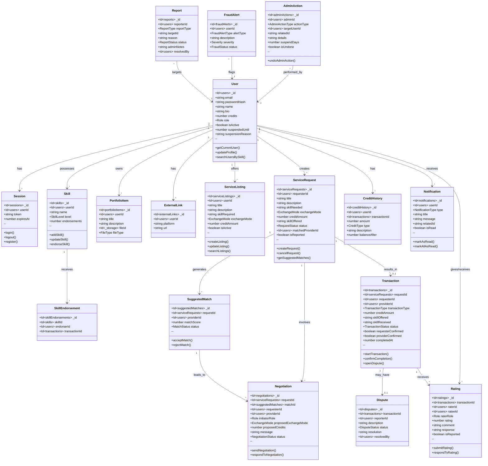

# SkillSwap Platform - UML Class Diagram

## System Overview

**SkillSwap** is a peer-to-peer skill exchange platform that enables users to trade skills either through direct skill swaps or a credit-based economy. The platform supports service listings, request matching, negotiations, transactions, ratings, and comprehensive admin moderation.

---

## High-Level Architecture Diagram



---

## Domain Packages

### 1. User Management Package

| Entity | Description |
|--------|-------------|
| **User** | Core user entity with authentication, profile, credits, and role management |
| **Session** | JWT-like token-based authentication sessions |
| **Skill** | User skills with expertise levels (beginner/intermediate/expert) |
| **SkillEndorsement** | Endorsements from other users after completed transactions |
| **PortfolioItem** | Images/documents showcasing user's work |
| **ExternalLink** | LinkedIn, GitHub, and other social/professional links |

### 2. Service Listings Package

| Entity | Description |
|--------|-------------|
| **ServiceListing** | Services offered by providers with flexible exchange modes |

### 3. Service Requests Package

| Entity | Description |
|--------|-------------|
| **ServiceRequest** | Requests posted by users seeking specific skills |
| **SuggestedMatch** | AI-generated matches based on skill compatibility and scores |
| **Negotiation** | Counter-offers and term discussions between parties |

### 4. Transactions Package

| Entity | Description |
|--------|-------------|
| **Transaction** | Actual skill exchanges with dual-confirmation workflow |
| **CreditHistory** | Complete audit trail of all credit movements |

### 5. Ratings & Feedback Package

| Entity | Description |
|--------|-------------|
| **Rating** | 1-5 star ratings with comments and responses |

### 6. Moderation & Admin Package

| Entity | Description |
|--------|-------------|
| **Report** | User, request, or feedback reports |
| **Dispute** | Transaction disputes requiring admin resolution |
| **FraudAlert** | System-detected suspicious activities |
| **AdminAction** | Complete audit log of all admin actions with undo capability |

### 7. Notifications Package

| Entity | Description |
|--------|-------------|
| **Notification** | Real-time user notifications for all platform events |

---

## Enumerations

### Exchange & Transaction Types

```
ExchangeMode: "credit" | "skill_swap" | "both"
TransactionType: "credit" | "skill_swap"
SkillLevel: "beginner" | "intermediate" | "expert"
```

### Status Enumerations

```
RequestStatus: "open" | "matched" | "in_progress" | "completed" | "cancelled"
MatchStatus: "pending" | "accepted" | "rejected"
NegotiationStatus: "pending" | "accepted" | "rejected" | "expired"
TransactionStatus: "pending" | "in_progress" | "completed" | "disputed" | "cancelled" | "reversed"
```

### Credit Operations

```
CreditType: "earned" | "spent" | "reserved" | "released" | "initial" | "adjustment"
```

### Moderation Statuses

```
ReportStatus: "pending" | "reviewed" | "resolved" | "dismissed"
DisputeStatus: "open" | "under_review" | "resolved" | "dismissed"
FraudStatus: "pending" | "investigating" | "resolved" | "dismissed"
FraudAlertType: "unusual_volume" | "repeated_transfers" | "suspicious_pattern"
Severity: "low" | "medium" | "high"
```

### Notification Types

```
NotificationType: "match_found" | "match_accepted" | "match_rejected" | 
                  "transaction_started" | "transaction_completed" | 
                  "rating_received" | "dispute_opened" | "dispute_resolved" |
                  "credit_received" | "negotiation_received" | 
                  "suspension" | "report_resolved" | "system"
```

### Admin Action Types

```
AdminActionType: "report_resolved" | "report_dismissed" |
                 "dispute_resolved" | "dispute_dismissed" |
                 "fraud_resolved" | "fraud_dismissed" | "fraud_investigating" |
                 "user_suspended" | "user_pardoned" |
                 "user_activated" | "user_deactivated"
```

---

## Key Workflows

### 1. Service Request & Matching Flow

```
┌─────────────────┐     ┌──────────────────┐     ┌─────────────────┐
│  User creates   │────▶│  System generates │────▶│  Matches shown  │
│ ServiceRequest  │     │  SuggestedMatches │     │   to requester  │
└─────────────────┘     └──────────────────┘     └────────┬────────┘
                                                          │
                        ┌────────────────────────────────┼────────────────────────────────┐
                        │                                │                                │
                        ▼                                ▼                                ▼
              ┌─────────────────┐            ┌─────────────────┐             ┌─────────────────┐
              │  Direct Accept  │            │   Send Counter  │             │  Reject Match   │
              │    (Match)      │            │     Offer       │             │                 │
              └────────┬────────┘            └────────┬────────┘             └─────────────────┘
                       │                              │
                       ▼                              ▼
              ┌─────────────────┐            ┌─────────────────┐
              │   Transaction   │◀───────────│   Negotiation   │
              │    Created      │            │     Process     │
              └─────────────────┘            └─────────────────┘
```

### 2. Transaction Lifecycle

```
┌───────────┐     ┌───────────────┐     ┌───────────────┐     ┌───────────────┐
│  PENDING  │────▶│  IN_PROGRESS  │────▶│   Both parties │────▶│  COMPLETED    │
│           │     │ (Provider     │     │    confirm     │     │  (Credits     │
│           │     │  starts work) │     │   completion   │     │  transferred) │
└───────────┘     └───────────────┘     └───────────────┘     └───────────────┘
      │                   │                                            │
      │                   │                                            ▼
      │                   ▼                                   ┌───────────────┐
      │           ┌───────────────┐                          │   RATINGS     │
      │           │   DISPUTED    │                          │   Exchange    │
      │           │ (Admin review)│                          └───────────────┘
      │           └───────────────┘
      │
      ▼
┌───────────┐
│ CANCELLED │
│ (Refund)  │
└───────────┘
```

### 3. Credit Flow

```
┌─────────────────────────────────────────────────────────────────┐
│                        CREDIT LIFECYCLE                          │
├─────────────────────────────────────────────────────────────────┤
│                                                                  │
│  ┌────────────┐    ┌────────────┐    ┌────────────┐             │
│  │  INITIAL   │───▶│  RESERVED  │───▶│   EARNED   │             │
│  │  (100 cr)  │    │ (-X credits│    │ (Provider  │             │
│  │            │    │  from req) │    │  receives) │             │
│  └────────────┘    └─────┬──────┘    └────────────┘             │
│                          │                                       │
│                          │ (If cancelled)                        │
│                          ▼                                       │
│                    ┌────────────┐                                │
│                    │  RELEASED  │                                │
│                    │ (Refunded) │                                │
│                    └────────────┘                                │
│                                                                  │
└─────────────────────────────────────────────────────────────────┘
```

---

## Database Indexes

| Table | Index Name | Fields | Purpose |
|-------|------------|--------|---------|
| users | by_email | [email] | Login lookup |
| users | by_role | [role] | Admin filtering |
| skills | by_userId | [userId] | User's skills |
| skills | by_name | [name] | Skill search |
| skills | by_name_and_level | [name, level] | Filtered matching |
| serviceListings | by_userId | [userId] | User's listings |
| serviceListings | by_isActive | [isActive] | Active listings |
| serviceRequests | by_requesterId | [requesterId] | User's requests |
| serviceRequests | by_status | [status] | Status filtering |
| serviceRequests | by_skillNeeded | [skillNeeded] | Skill matching |
| transactions | by_requesterId | [requesterId] | User transactions |
| transactions | by_providerId | [providerId] | Provider transactions |
| transactions | by_status | [status] | Status filtering |
| notifications | by_userId | [userId] | User notifications |
| notifications | by_userId_and_isRead | [userId, isRead] | Unread count |
| sessions | by_token | [token] | Token validation |

---

## Technology Stack

| Layer | Technology |
|-------|------------|
| **Frontend** | React + TypeScript |
| **UI Framework** | Tailwind CSS + shadcn/ui |
| **Backend** | Convex (Real-time Backend-as-a-Service) |
| **Database** | Convex Document Store |
| **Authentication** | Custom session-based auth |
| **File Storage** | Convex Storage |

---

## Security Considerations

1. **Authentication**: Session-based with expiration tokens
2. **Authorization**: Role-based (user/admin) with ownership checks
3. **Suspension System**: Temporary account restrictions with reasons
4. **Credit Escrow**: Credits reserved during pending transactions
5. **Reporting System**: Multi-level report handling (request/feedback/user)
6. **Audit Trail**: Complete admin action logging with undo capability
7. **Fraud Detection**: Automated alerts for suspicious patterns

---

*Generated for SkillSwap Platform - A Peer-to-Peer Skill Exchange Marketplace*

